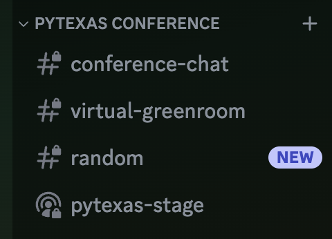

Thank you for attending the PyTexas Conference Virtually! 

The virtual conference portion will be held in the [PyTexas Discord Server](https://discord.gg/pytexas)

## Gaining Access to the Correct Channels

1. Join the [PyTexas Discord Server](https://discord.gg/pytexas)
1. Check-In and receive the `Conference 2027 Attendees` role
    1. In _any_ text channel you can type the command: `/register EMAIL_ADDRESS`
    where `EMAIL_ADDRESS` is the email address that was used to register your ticket.
        1. When you type the command you should see a prompt for your `attendee_email` like this:
          
        This will send an ephemeral message, meaning only you will be able to see it. 
        1. On success, you should see the output `Registered!`, have the role 
        `Conference 2027 Attendees` added to your profile, and have access to the 
        `PyTexas Conference` section and channels on the left hand nav bar.
        
            1. If this command does not work for you, try a few more times. If 
            that still doesn't work, send and email to [registration@pytexas.org](mailto:registration@pytexas.org).
            1. If you purchased your ticket as part of a group you may be unable to 
            register. Please email [registration@pytexas.org](mailto:registration@pytexas.org) 
            and we'll get this fixed for you.

## Watching the Talks

All talks will be streamed via an unlisted stream on the PyTexas YouTube channel. 
This link will be provided the day of the conference, prior to the start of the event.
Comments on the video will be disabled, and we will ask all attendees to interact within the Discord server.

## Interacting with Other Attendees

We encourage you to interact with your fellow attendees! Networking at conferences
is half the fun! All attendees, in-person and virtual, have access to the Discord
server. There is a `#conference-chat` text channel in the `PyTexas Conference` 
section that should be used for conference related discussions. There is also
a `#random` channel for you to use to discuss anything and everything (so long as
it is within our code of conduct.)

**Please keep all discussions appropriate and in accordance with our [Code of Conduct](../about.md#code-of-conduct)**

## Asking the Speaker Questions

<!-- TODO: Update Slido link when created -->
This year we will be using [Slido](https://pytexas.org/2027/slido)
to ask the speaker questions. Slido allows you to submit your question and up-vote
other questions you'd like to hear the answer to. 

[Join the Slido](https://pytexas.org/2027/slido){: .pytx-button .pytx-button--primary}
